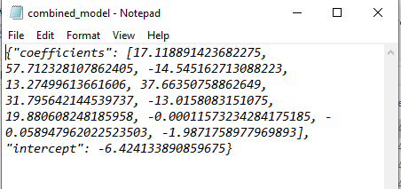
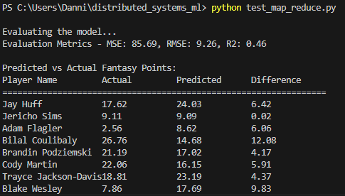

# HOW TO RUN THE DISTRIBUTED SYSTEM FOR A MAPREDUCE/LINEAR REGRESSION JOB

Terminology: 
Client 
    1 Client instance will be created during program execution. The Client instance is located in the source directory. The Client is responsible for receiving jobs and extracting tasks to pass on to the MasterNode, chunking any large files included in the tasks as needed
MasterNode 
    1 MasterNode instance will be created during program execution, and the instance will run in one of the directories that the user creates (MasterNode directory). MasterNode is responsible for keeping tracking of WorkerServer and WorkerClient instances and passing on requests related to data retrieval and job handling
Worker 
    Each Worker instance will run in a separate directory that the user creates (Worker directory). The Worker class contains 1 WorkerServer instance and 1-5 WorkerClient instances. Multiple Worker instances can be created. Worker is responsible for initializing WorkerServer and WorkerClients
WorkerServer 
    1 WorkerServer instance will run in each Worker directory, and it will be initialized by the Worker. WorkerServer is a server that executes tasks when a request is received from a WorkerClient
WorkerClient 
    1-5 WorkerClient instances will run in each Worker directory, and each instance will be initialized by the Worker when it receives a task from JobManager. The WorkerClient communicates by default with the WorkerServer instance located in the same directory, although WorkerClients can also communicate with other WorkerServers, or with MasterNode or Client, depending on the task requirements

1. Open the program files in an IDE 

2. Create new folders outside of the source directory (for example, 4 new folders). During program execution, the source directory will contain the Client instance, 1 of the new folders will contain the MasterNode instance, and the remaining folders will contain the Worker instances. Each Worker instance contains the following: 1 server and multiple clients. 
The overall structure should look something like this: 
+ Source directory 
+ MasterNode directory
+ Worker directory
+ Worker directory
+ Worker directory

3. Copy all program files into each of the new directories

4. In each new directory, create a file called config.json. This file will be used to configure the role, IP, and port of each MasterNode, WorkerServer, and WorkerClient instance. Select a directory to contain the MasterNode instance; there should only be 1 MasterNode during program execution. In the corresponding config file, input the following, replacing <unique_port> with a port number of your choosing (i.e. "port": 5679): 
[
    {
        "is_master": true,
        "ip": "localhost",
        "port": <unique_port>
    }
]

The overall structure should now look something like this:
+ Source directory - contains all program files
+ MasterNode directory - contains all program files and a config.json that defines the MasterNode
+ Worker directory - contains all program files and a config.json that defines the WorkerServer and WorkerClients
+ Worker directory - contains all program files and a config.json that defines the WorkerServer and WorkerClients
+ Worker directory - contains all program files and a config.json that defines the WorkerServer and WorkerClients

5. In the Worker directories, input the following to configure 1 WorkerServer and multiple WorkerClients (up to 5), replacing <unique_port> with a port number of your choosing (i.e. "port": 5679):
[
    {
        "is_master": false,
        "ip": "localhost",
        "port": <unique_port>,
        "role": "WorkerServer"
    },
    {
        "is_master": false,
        "ip": "localhost",
        "port": <unique_port>,
        "role": "WorkerClient"
    },
    {
        "is_master": false,
        "ip": "localhost",
        "port": <unique_port>,
        "role": "WorkerClient"
    },
    {
        "is_master": false,
        "ip": "localhost",
        "port": <unique_port>,
        "role": "WorkerClient"
    }
]

Each WorkerServer and WorkerClient must have a unique port address across directories

6. Navigate back to the source directory. Open the "run.sh" file and make the following changes to the file: 
- In line 5, replace the paths with the absolute paths to your newly created Worker directories
- In line 17, replace the path with the absolute path to your newly created MasterNode directory

7. Open the "job.json" file in the source directory. This file is used to submit job instructions to the system. Each item in the job file will be processed as a task. The following job methods are accepted: 

[
    {
        "method": "mapreduce",
        "header_list": {
            "keys": [<name_of_file>, <name_of_file>] 
            <!-- Ex. "keys": ["nba_game_logs_2022_23.csv", "nba_game_logs_2023_24.csv"] -->
        },
        "payload": ""
    },
    {
        "method": "send_data",
        "header_list": {
            "key": <name_of_file>
            <!-- Ex. "key": "username.csv" -->
        },
        "payload": ""
    },
    {
        "method": "send_data",
        "header_list": {
            "key": <key_for_single_value>
            <!-- Ex. "key": "revenue" -->
        },
        "payload": <value_for_single_value>
        <!-- Ex. "payload": 8300 -->
        <!-- The value can be of any data type (i.e. string, integer, decimal) -->
    },
    {
        "method": "retrieve_data",
        "header_list": {
            "key": <key_for_single_value>
            <!-- Ex. "key": "revenue" -->
        },
        "payload": ""
    },
    {
        "method": "retrieve_data",
        "header_list": {
            "key": <name_of_file>
            <!-- Ex. "key": "username.csv" -->
        },
        "payload": ""
    }
]

The job file can handle multiple tasks, with each task running in parallel. Please note that, because tasks are designed to run in parallel within a job file, each task should not have any dependencies on another task. If you need to run tasks with dependences, create a new job file (i.e. job2.json) and input these tasks here. When running the program, ensure that job2.json is listed after job.json

8. After creating your job file(s), open "run.sh" again and update line 12 with the absolute paths to your job files

9. This program uses the following librares: 
nba-api==1.5.2
json-rpc==1.15.0
numpy==1.24.4
Install these requirements into your system.

10. The mapreduce task is designed to work with NBA game logs from the official NBA website. To retrieve these, you must generate the datasets using the nba_api API. Open the "get_stats.py" file. This is used to generate the datasets. In line 6, input a value for "season_nullable" to download the dataset for that season. The seasons that I used while testing were: 2022-23, 2023-24, and 2024-25. Download each of these datasets by running "get_stats.py". The datasets should now appear in your source directory. 

11. Run "run.sh" by opening Git Bash and entering: "./run.sh". Program execution will now begin.

12. After program execution finishes, view the logs in the console to see job results. Navigate to each directory to view any files that were outputted during the job. For example, when running a mapreduce task, the following files will be generated: 
-Preprocess files that contain the features used in the Map phase
-Map files that contain the results of model training for each individual file/file chunk
-1 combined_model file that contains the final model training results, which aggregate the model training result of each file/file chunk

Sample directory with generated mapreduce output:

13. For the mapreduce task, the combined_model contains the coefficients and intercept of the final trained model. To view predictions derived using this model, you can use the "test_map_reduce.py" program. Set the testing_csv_file to one of the NBA datasets. Input the final trained model into combined_model. Then, run "test_map_reduce.py". The program will use the selected NBA dataset as a test dataset, first removing any columns related to Fantasy Points. In the console, the prediction results will be printed, including the name of the player, actual fantasy points, predicted fantasy points, and the difference between actual and predicted. The output will also display some metrics for the model's accuracy.

Sample output of combined_model:

Sample output of predictions using combined_model:
